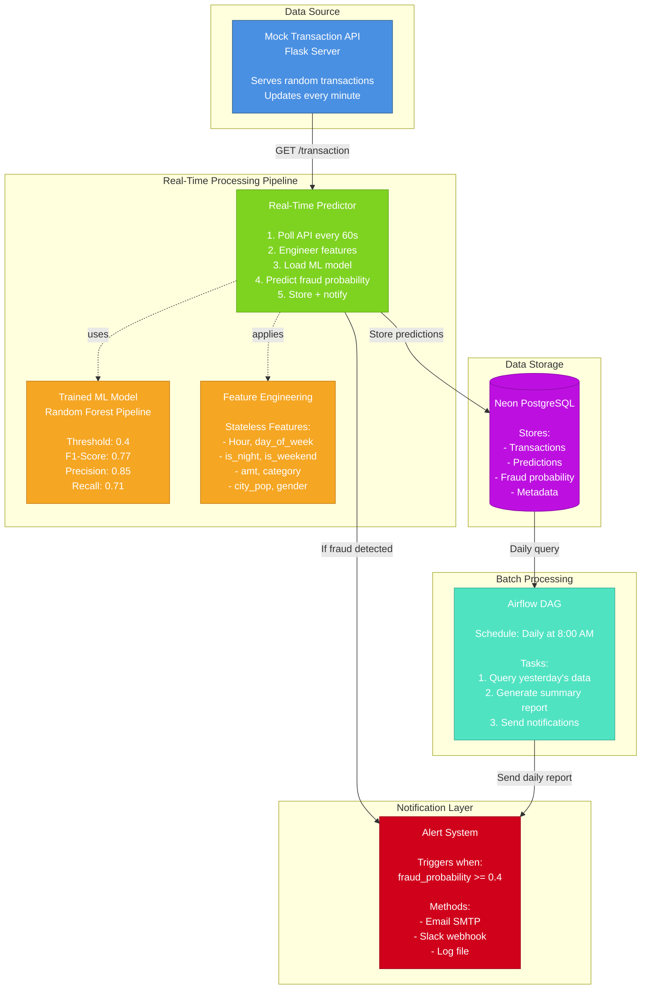

# Fraud Detection System - Architecture

## System Overview

This document describes the complete architecture of the real-time fraud detection system.

## Architecture Diagram



## Component Details

### 1. Data Source Layer
**Mock Transaction API (Flask)**
- Simulates real-time payment stream
- Serves random transactions from test dataset
- Endpoint: `http://localhost:5000/transaction`
- Health check: `http://localhost:5000/health`
- Mimics production API behavior

### 2. Real-Time Processing Pipeline

**Real-Time Predictor (`src/real_time_predictor.py`)**
- **Polling frequency:** 60 seconds
- **Feature engineering:** Stateless (no DB lookups required)
- **Model:** sklearn Pipeline (preprocessing + Random Forest)
- **Threshold:** 0.4 fraud probability
- **Output:** Prediction stored in PostgreSQL, notification if fraud

**ML Model**
- Algorithm: Random Forest Classifier
- Training: 333,431 transactions
- Validation: 111,144 transactions  
- Test: 111,144 transactions
- Performance:
  - F1-Score: 0.77
  - Precision: 0.85 (85% of alerts are real fraud)
  - Recall: 0.71 (catches 71% of frauds)
  - PR-AUC: 0.804

**Feature Engineering (Stateless)**
- Temporal: `hour`, `day_of_week`, `is_night`, `is_weekend`
- Financial: `amt` (transaction amount)
- Categorical: `category` (One-Hot Encoded), `gender`
- Demographics: `city_pop`
- **Note:** No customer history required → fast real-time prediction

### 3. Data Storage

**Neon PostgreSQL (Cloud)**
- Free tier: 0.5 GB storage
- Table: `fraud_transactions`
- Stores: transaction details, fraud probability, prediction, timestamp
- Indexed on: timestamp, predicted_fraud
- Connection: via environment variable `NEON_CONNECTION_STRING`

**Schema:**
```sql
CREATE TABLE fraud_transactions (
    id SERIAL PRIMARY KEY,
    transaction_id VARCHAR(100) UNIQUE NOT NULL,
    timestamp TIMESTAMP NOT NULL,
    amount DECIMAL(10, 2) NOT NULL,
    category VARCHAR(50),
    merchant VARCHAR(255),
    gender VARCHAR(10),
    city_pop INTEGER,
    lat DECIMAL(10, 6),
    long DECIMAL(10, 6),
    fraud_probability DECIMAL(5, 4),
    predicted_fraud BOOLEAN,
    created_at TIMESTAMP DEFAULT CURRENT_TIMESTAMP
);
```

### 4. Batch Processing

**Airflow DAG (`airflow/daily_fraud_report_dag.py`)**
- **Schedule:** Daily at 8:00 AM (cron: `0 8 * * *`)
- **Task 1:** Query yesterday's transactions from PostgreSQL
- **Task 2:** Generate summary report (totals, fraud rate, financial impact)
- **Task 3:** Send notification/report
- **Orchestration:** Task dependencies managed by Airflow
- **Retry logic:** 2 retries with 5-minute delay

### 5. Notification Layer

**Alert System**
- **Real-time:** Triggered when `fraud_probability >= 0.4`
- **Daily batch:** Summary report from Airflow
- **Methods:**
  - Email (SMTP configuration in `.env`)
  - Slack (webhook URL in `.env`)
  - Log file (default for demo: `logs/fraud_detection.log`)

## Data Flow

### Real-Time Flow (Every 60 seconds)
```
1. API serves random transaction
2. Predictor fetches via HTTP GET
3. Features engineered (temporal, amount, category)
4. Model predicts fraud probability
5. IF probability >= 0.4:
   - Store prediction in DB
   - Send fraud alert notification
   ELSE:
   - Store prediction in DB only
6. Loop continues
```

### Batch Flow (Daily at 8:00 AM)
```
1. Airflow DAG triggered by scheduler
2. Query all transactions from previous day
3. Calculate summary statistics:
   - Total transactions
   - Fraud count & rate
   - Financial impact (total amount, fraud amount)
   - Detection metrics (avg probability, max probability)
4. Format report
5. Send via configured notification method
```

## Technology Stack

| Component | Technology | Purpose |
|---|---|---|
| ML Model | scikit-learn (RandomForest) | Fraud classification |
| API | Flask | Mock transaction stream |
| Database | PostgreSQL (Neon) | Store predictions |
| Orchestration | Apache Airflow | Batch processing |
| Language | Python 3.8+ | All components |
| Environment | python-dotenv | Configuration management |

## Configuration

All configuration centralized in `config/config.py`:
- Database connection string
- Model path and threshold
- API endpoint and polling interval
- Notification settings (SMTP, Slack)
- File paths (data, models, logs)

Sensitive values (passwords, connection strings) stored in `.env` file (not committed to git).

## Production Considerations

### Current Implementation (v1)
- ✅ Stateless features (fast, simple)
- ✅ No database lookup for predictions
- ✅ Polling-based architecture
- ✅ Single-threaded processing

### Future Enhancements (v2)
- ⏭️ **Stateful features** for better accuracy:
  - `amt_ratio_to_customer` (5x fraud signal improvement)
  - `time_since_last_transaction`
  - Cold start fallback using category averages
- ⏭️ **Message queue** (Kafka/RabbitMQ) instead of polling
- ⏭️ **Horizontal scaling** for prediction service
- ⏭️ **MLflow** for experiment tracking and model versioning
- ⏭️ **Docker** containerization for deployment
- ⏭️ **Monitoring dashboard** (Grafana + Prometheus)

## Deployment

1. **Setup:**
   ```bash
   pip install -r requirements.txt
   cp .env.example .env
   # Edit .env with actual credentials
   ```

2. **Start components:**
   ```bash
   # Terminal 1: Mock API
   python src/mock_transaction_api.py
   
   # Terminal 2: Real-time predictor
   python src/real_time_predictor.py
   
   # Terminal 3: Airflow (optional)
   cd airflow && airflow standalone
   ```

3. **Generate demo report:**
   ```bash
   python src/generate_demo_report.py
   ```

## Monitoring & Logs

- **Real-time logs:** `logs/fraud_detection.log`
- **Airflow logs:** `airflow/logs/`
- **Demo reports:** `logs/demo_report_*.txt`

## Author

**Agnès Heijligers** - for Jedha AI Architect Certification  
Exam Date: March 17th, 2026
